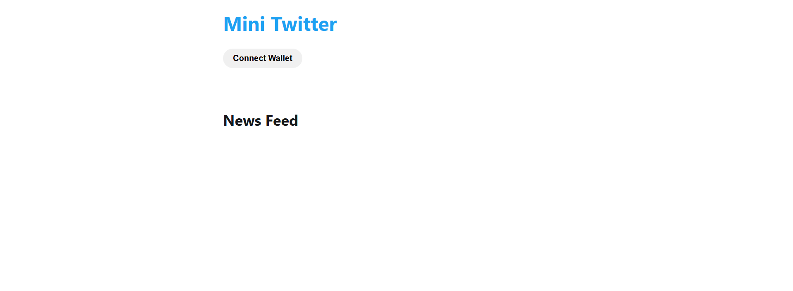
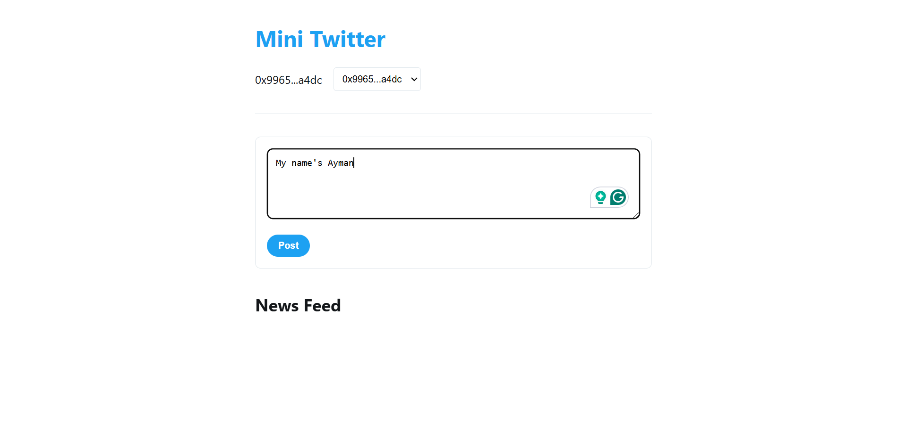

# SocialMedia-DAPP-Ethereum
Ethereum-based DAPP utilizing smart contracts for decentralized user engagement

MiniTwitter is a decentralized application (DAPP) built on the Ethereum blockchain. It allows users to interact with a social media-like platform in a fully decentralized and secure way. Users can create, edit, like, and dislike posts while leveraging the transparency and immutability of blockchain technology. This project is a simple example designed to help discover the decentralized application (dApp) field.

## Overview
**First Page**: Connection to the wallet  

**Home Page**: View, Write posts and interact with them  

  

**Accept the transaction**  
  

**Edit your own posts**  

  

**Each account can edit its own posts**  
  

## Features
- **Create Posts**: Users can create posts that are stored on the Ethereum blockchain.
- **Edit Posts**: Authors have the ability to edit their own posts.
- **Reactions**: Users can like or dislike posts, with each reaction securely recorded on the blockchain.
- **Decentralization**: All data is managed through a smart contract, ensuring no central authority controls the content.

## Technologies Used
- **Solidity**: For writing smart contracts.
- **Ethereum**: As the blockchain platform.
- **HTML, CSS, JavaScript**: For the frontend.
- **MetaMask**: For connecting to the Ethereum network.

> This project serves as a basic introduction to the dApp space, exploring the integration of Ethereum smart contracts in a simple social media-like application.
